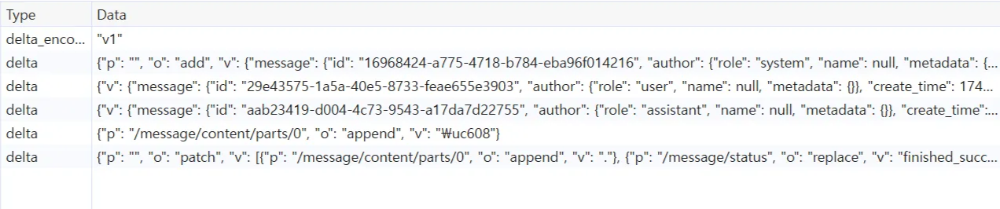

## 구조화된 출력 (Structured Output)

LLM은 일반적으로 대화형 인터페이스에서 자연어 텍스트를 생성하는 데 사용되지만, AI 애플리케이션에서는 구조화된 데이터 출력이 필요한 경우가 많습니다.  

이를 위해 LLM 제공 업체들은 특정 스키마를 준수하는 JSON 형식의 출력을 강제하는 구조화된 출력(structured output) 기능을 제공합니다. (예: [OpenAI](https://platform.openai.com/docs/guides/structured-outputs?api-mode=chat), [Google](https://ai.google.dev/gemini-api/docs/structured-output))

## 구조화된 출력의 스트리밍

복잡하거나 큰 JSON 구조를 생성해야 하는 경우, 전체 응답이 완료될 때까지 기다려야 하므로 사용자 경험이 저하될 수 있습니다. 이때 필요한 것이 바로 스트리밍입니다.  

LLM 스트리밍은 응답을 토큰 단위로 생성하면서 실시간으로 부분적인 결과를 전송하는 방식입니다. 전체 JSON이 완성될 때까지 기다리는 대신, 생성되는 부분부터 순차적으로 클라이언트에 전달합니다.  

예를 들어, `{"userId": "12345"}`가 최종적인 전체 응답이라면, 다음과 같이 토큰 단위로 응답이 스트리밍될 수 있습니다:

1. `{` 
2. `"` 
3. `user`  
4. `Id`
5. `":`
6. ...

하지만 마지막 토큰을 받기 전까지는 완전한 JSON 형태가 아니므로 일반적인 JSON 파서를 활용할 수 없습니다. 이 문제를 어떻게 해결해야 할까요?

### 부분 파싱 (Partial Parsing)

기존에도 JSON을 스트리밍 방식으로 파싱할 수 있는 라이브러리가 존재하지만, 일반적으로는 파싱 관점에서의 토큰(LLM 토큰과는 다름)이 완성된 후에야 사용자에게 정보가 전달됩니다.  

예를 들어, JSON이 `{"sentence": "Hello,`처럼 따옴표가 닫히지 않은 상태라면, 닫는 따옴표를 만날 때까지 기다려야 비로소 `sentence`의 값을 얻을 수 있습니다. 구조화된 응답이라도 긴 문자열을 포함할 수 있기 때문에, 기존의 스트리밍 파서로는 원하는 수준의 응답성을 구현하기 어려울 수 있습니다.  

이러한 문제를 해결하기 위해, 스트리밍 도중의 불완전한 JSON을 파싱할 수 있는 라이브러리들이 있습니다:

* Python: [json_repair](https://github.com/mangiucugna/json_repair)  
* JavaScript: [openai-partial-stream](https://github.com/st3w4r/openai-partial-stream)  
* (이 외에도 다양한 라이브러리가 존재합니다.)

위에서 예시로 든 `{"sentence": "Hello,`를 부분 파싱하면, `{"sentence": "Hello,"}`처럼 현재까지 파악된 정보를 바탕으로 완성된 형태의 객체를 추출할 수 있습니다.

### 부분 파싱: 희망 사항

LLM에 넘길 JSON 스키마를 정의할 때 Pydantic이나 Zod 같은 라이브러리를 사용하게 되는데요. **완성된 타입 정의로부터 부분 파싱된 객체의 타입 정의를 도출**할 수 있다면 편리할 것 같습니다.
(특히 Pydantic은 런타임에 스키마 정의하는 것은 가능하지만 mypy와 같은 정적 타입 검사 도구에서 부분 파싱된 객체의 타입을 추론할 수 있는 방법이 없는 것 같습니다.)

또한 **객체의 어떤 부분이 부분 파싱된 상태인지 알 수 있는 파서**가 있다면, 필드에 따라 부분 파싱된 경우의 표현 방식을 다르게 할 수 있어 유용할 것 같습니다.

예를 들어, `{"title": "Hello, world!", "tags": ["python", "llm"]}`과 같은 JSON에서 `title`은 완성되지 않은 상황에서도 노출하고, `tags`는 완성된 항목만 노출하기를 원할 수 있습니다.

즉 `"tags": ["python", "ll`까지 들어왔을 때는 두번째 태그는 아직 미완성인 상태이므로 `python`만 노출하는 것입니다. 그런 경우에 파싱 결과를 다음과 같이 얻을 수 있으면 원하는 기능을 구현할 수 있을 것 같습니다.

```json
{
    "title": "Hello, world!",
    "tags": ["python", "ll"],
    "$partial": {"tags": true}
}
```

위와 같은 기능을 제공하는 라이브러리를 아직 찾지 못했는데, 만약 없다면 오픈소스 프로젝트로 만들어보기 좋을 것 같습니다.

## 구조화된 출력 스트리밍과 API 설계

실제 애플리케이션을 구현할 때, 프론트엔드에서 LLM 제공자를 직접 호출하기보다는 요금 부과나 사용량 제한 등을 관리하기 위해 백엔드 서버를 경유하는 것이 일반적입니다. 이 경우, 구조화된 출력을 스트리밍한다면 API를 어떻게 설계하는 것이 좋을까요?

가장 단순한 방법은 백엔드가 LLM이 출력하는 JSON 문자열 조각을 그대로 프론트엔드에 전달하고, 프론트엔드에서 부분 파싱을 수행하는 것입니다. 하지만 여기에는 몇 가지 문제가 있습니다:

* **구현 세부 정보 노출**: LLM의 스키마가 프론트엔드까지 노출되어 불필요한 결합이 발생합니다. 더 나은 생성 결과를 위해 스키마를 변경하면 프론트엔드 코드까지 수정해야 할 수 있습니다.  
* **호환성 문제**: 새로운 기능을 구현하기 위해 LLM 스키마를 변경할 때, 이전 버전의 프론트엔드와 동시에 호환되도록 만들기가 어려울 수 있습니다.

### 호환성 문제의 예시

장소 리뷰를 요약하는 서비스를 예로 들어보겠습니다.  

원래 다음과 같은 내용을 생성하고 있었다고 가정합니다 (v1):

```js
{  
  "summary": [
    "음식이 맛있어요",
    "인테리어가 멋져요",
    "재료가 신선해요"
  ]
}
```

각 요약 항목에 이모지를 추가하는 요구사항이 새로 생겼다고 가정해봅시다 (v2):  

```js
{  
  "summaryV2": [
    {"emoji": "🍽️", "text": "음식이 맛있어요"},
    {"emoji": "🏠", "text": "인테리어가 멋져요"},
    {"emoji": "🥗", "text": "재료가 신선해요"}
  ]  
}
```

위 v2 응답이 v1 프론트엔드와도 호환되려면 다음과 같은 형식이 되어야 합니다:

```js
{  
  "summaryV2": [
    {"emoji": "🍽️", "text": "음식이 맛있어요"},
    {"emoji": "🏠", "text": "인테리어가 멋져요"},
    {"emoji": "🥗", "text": "재료가 신선해요"}
  ],
  "summary": [
    "음식이 맛있어요",  
    "인테리어가 멋져요",  
    "재료가 신선해요"  
  ]
}
```

이때 LLM에 v1과 v2 호환 형식에 맞게 생성을 요청하면 몇 가지 문제가 발생할 수 있습니다:

* 응답이 앞에서부터 순차적으로 생성되므로, v1 프론트엔드는 `summaryV2` 필드가 생성되는 동안 아무런 결과를 출력할 수 없습니다.  
* `summaryV2`와 `summary`의 텍스트 내용이 일치한다고 보장할 수 없습니다.
* 중복된 내용을 생성하므로 LLM 출력 비용이 추가로 발생합니다.

클라이언트 버전을 확인하여 응답 생성 버전을 분기하는 방법으로 해결할 수 있지만, 여전히 구현 세부 정보 노출 문제는 남아있습니다.

### 객체 동기화 방식

v2 응답 스트림에서 파생되는 v1 호환용 필드까지 함께 클라이언트에 실시간으로 전달하는 것은, 단순 선형 스트리밍 방식으로는 구현하기 어렵습니다. 따라서 JSON 조각을 선형적으로 스트리밍하는 대신, 백엔드와 프론트엔드 간에 JSON 객체를 동기화하는 방식으로 접근 방식을 바꿔볼 수 있습니다.

이렇게 하면 백엔드에서 프론트엔드에 전달하는 객체의 형식이 훨씬 자유로워지고, LLM의 출력 스키마와도 결합을 줄일 수 있습니다. 하위호환 문제도 프론트엔드에 전달하기 직전에 변환 단계를 추가해서 v1 하위 호환 필드를 채워주면 호환성 문제를 해결할 수 있습니다.

객체 동기화의 구체적인 방법으로, 간단하게는 백엔드에서 부분 파싱된 객체 전체를 매번 프론트엔드에 전달할 수 있습니다. 그러나 전체 객체를 매번 전송하는 방식은 데이터 중복으로 인해 통신이 비효율적이 됩니다. 더 효율적인 통신을 위해서는 변경 사항만을 전달할 필요가 있습니다. 이를 위해 [JSON Patch (RFC 6902)](https://datatracker.ietf.org/doc/html/rfc6902)와 같은 표준을 활용해볼 수 있습니다.

아쉽게도 JSON Patch의 한계점 중 하나는, LLM이 생성하는 긴 텍스트처럼 점진적으로 내용이 추가되는 문자열을 표현하기 위한 '덧붙이기(append)' 연산이 표준에 직접적으로 정의되어 있지 않다는 것입니다. 따라서 매우 긴 문자열 필드를 스트리밍할 때는 (비효율적으로) 항상 문자열 전체를 교체해야 합니다. 필요하다면 별도로 append 연산을 정의해볼 수 있겠습니다.

참고로 ChatGPT도 JSON 객체의 변경사항만을 스트리밍하는 방식을 사용하는 것을 확인할 수 있습니다.



## 결론

- LLM에서 구조화된 JSON 출력을 스트리밍할 때, 부분 파싱을 통해 실시간으로 결과를 처리할 수 있습니다.
- JSON 조각을 단순히 스트리밍하는 것보다는, 객체 동기화 방식이 프론트엔드와의 결합을 줄이고 하위 호환성을 유지할 수 있다고 생각합니다.
